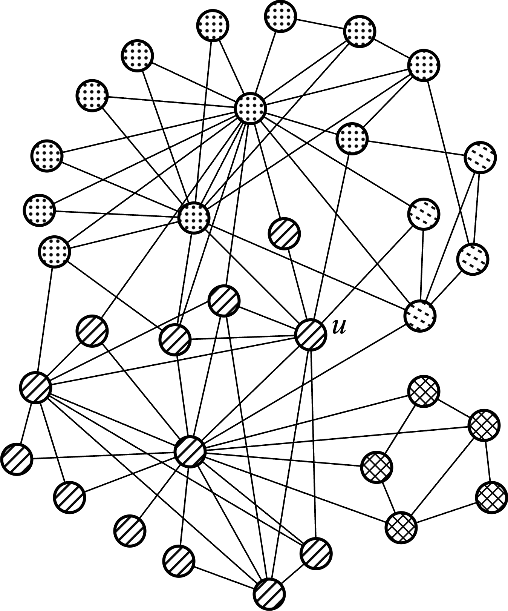
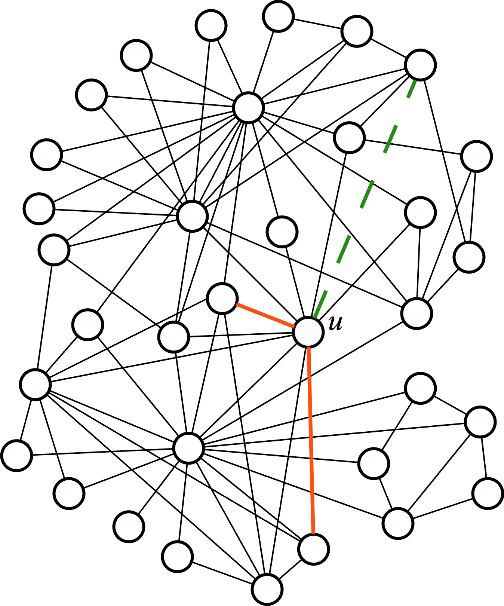
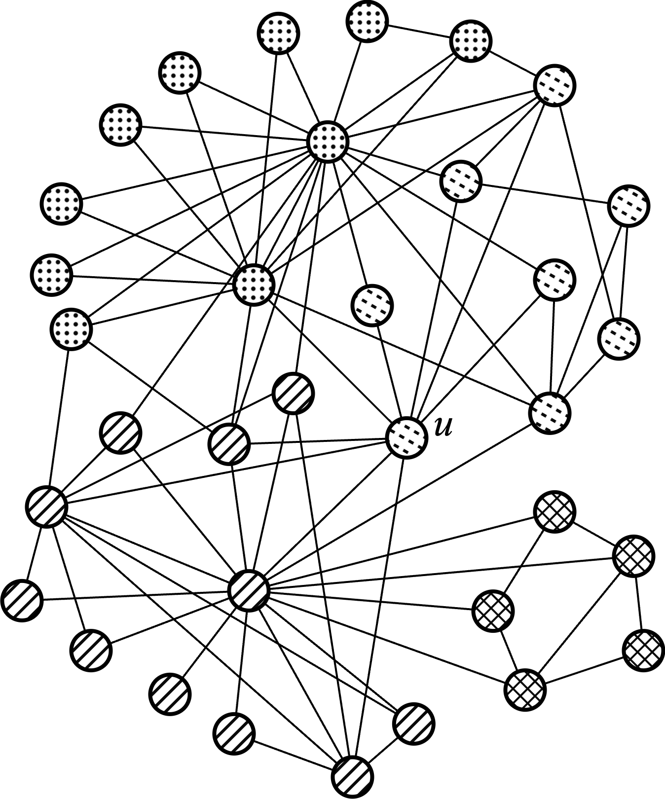

# Community Membership Hiding

## Introduction

Community detection is a fundamental problem in network science, where algorithms attempt to uncover groups of nodes—called communities—that share strong internal connections. While this task is widely applied in areas such as social networks, recommendation systems, and biological data analysis, it raises significant privacy concerns. Being identified as a member of a community can expose sensitive affiliations, such as political, religious, or professional memberships, which individuals may wish to keep private.

The **Community Membership Hiding (CMH)** problem addresses this issue by strategically modifying a network’s structure to obscure a target node’s membership in a specific community. Given a network and a community detection algorithm, the goal is to perturb the network in a way that prevents the target node from being recognized as part of its original community.

This repository provides an implementation of **∇-CMH**, a gradient-based optimization approach, and a **Deep Reinforcement Learning (DRL) agent** method for community membership hiding. 

Our implementation supports multiple real-world network datasets and different community detection algorithms.

## Problem Definition

Let $G = (V, E)$ be an undirected graph where $v$ is the set of nodes and $E$ is the set of edges. A **community detection algorithm** $f(\cdot)$ partitions the nodes into non-overlapping communities $\{C_1, C_2, ..., C_k\}$, where each node belongs to exactly one community. Given a **target node** $u$ that belongs to a community $C_i$ (i.e., $u \in C_i$), the objective of the CMH problem is to modify the structure of $G$ such that, when the community detection algorithm $f(\cdot)$ is applied to the modified graph $G'$, the node $u$ is no longer recognized as a member of $C_i$.

  
  
  

### Counterfactual Graph Search

To achieve this, we define a **perturbation function** $h_{\theta}(\cdot)$, parameterized by $\theta$, that modifies $g$ into a new graph $G' = h_{\theta}(G)$ by adding or removing edges in the neighborhood of $u$. The goal is to find an optimal function $h^*_{\theta}$ that ensures $u$ is removed from its original community:

$$\theta^* = \arg\min_{\theta} L(h_{\theta}; G, f, u)$$

subject to a **budget constraint** on the number of modifications $|B| \leq \beta$, where $B$ is the set of edges modified, and $\beta$ represents the maximum number of allowed changes.

The effectiveness of the hiding process is measured using a **similarity function** $\text{sim}(C_i - \{u\}, C'_i - \{u\})$, which compares the original community $C_i$ and the new assigned community $C'_i$ in the modified graph $G'$. The hiding task is considered successful if:

$$
\text{sim}(C_i - \{u\}, C'_i - \{u\}) \leq \tau
$$

where $\tau$ is a predefined threshold controlling the required level of dissimilarity, which ranges between $0$ and $1$.

## Requirements

